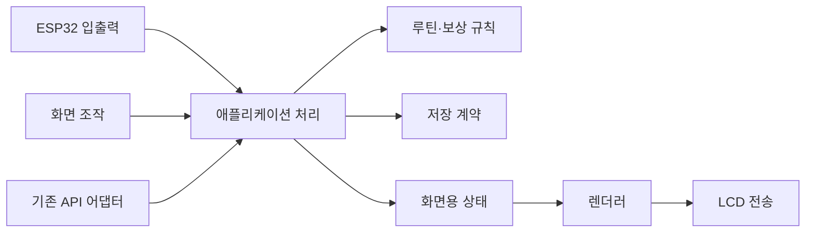

# 시스템 설계

## 설계 목표

버튼 수, 테마, 화면, 서버 API, 저장 방식이 바뀔 때 루틴 규칙을 다시 쓰지 않게 한다. 또한 화면 연출이 멈추거나 네트워크가 끊겨도 완료 기록과 보상 상태가 모순되지 않도록 한다. 추상화는 실제 교체 지점에만 둔다. 모든 기능에 Manager·Service·인터페이스를 하나씩 만드는 방식은 사용하지 않는다.

## 책임과 의존 방향

| 영역 | 소유하는 것 | 알면 안 되는 것 |
|---|---|---|
| domain | 루틴 실행, 완료·포기·시간 초과, 보상 권리, 콘텐츠 규칙 | GPIO, Arduino, HTTP, Figma 좌표, 애니메이션 프레임 |
| application | 입력 의도를 유스케이스로 처리, 저장 성공 후 결과 공개, 동기화 조정 | 이미지 픽셀·SPI 초기화 |
| presentation | 현재 화면·초점·확인창·연출 진행, 화면용 읽기 모델, 그리기 | DB/플래시 직접 쓰기, 완료·성장 수치를 임의 수정 |
| platform | GPIO·LCD·부저·시간·저장·통신의 실제 구현 | 제품의 성공·실패·성장 규칙 |
| diagnostics | 하드웨어 확인용 샘플값과 테스트 명령 | 제품 데이터로 샘플을 자동 승격하는 동작 |

시작점인 `.ino`는 구성과 반복 실행 연결만 담당한다. 반복문에서 루틴 규칙·시리얼 파싱·LCD 드라이버를 한꺼번에 처리하지 않는다. 휴대 가능한 C++ 코드는 같은 소스로 PC 시나리오 검증과 장치 빌드에 포함한다. 새 폴더는 해당 기능의 실제 코드가 생길 때 만들며 빈 모듈은 미리 늘리지 않는다.

v0.5 리팩토링에서 실제 변경 지점을 다음과 같이 분리했다.

- `ProductController.cpp`: 시간 진행, 재시작 복원, 상태 후보 작성과 저장 확정, 다음 표시 상태 결정.
- `ProductInput.cpp`: 공통 입력 유효성 검사 후 홈·도감·캐릭터·보상·성장·요약·루틴별 버튼 처리. 동일 컨트롤러의 구현이며 별도 상태를 소유하지 않는다.
- `ProductView.h`: 렌더러가 읽는 화면 데이터와 입력 대상 동일성 판별. 렌더러가 컨트롤러의 변경 메서드를 의존하지 않는다.
- `RewardLedger.*`: 완료 권리의 미배정 먹이만 결정하고, 소비 여부/먹이 종류에 맞는 권리를 조회한다. 완료 시점과 v1 이행에서 같은 배정 규칙을 사용한다.
- `Drawing.*`: 글꼴·이미지·RGB565 혼합·줄바꿈. `ProductRenderer.cpp`는 이름 있는 화면별 함수로 배치를 구성한다.
- `CatalogRenderer.*`: Figma 도감의 카드·탐색 표시·도감용 그림/텍스트. 홈 배경과 분리하며 제품 상태를 읽기만 한다. 도감용 자산/네이티브 글꼴은 `generate_catalog_assets.py`에서 생성한다.

저장 주체와 순서를 유지해 소비·경험치가 분리 저장되지 않도록 했다. 스키마와 성장/조작 정책을 변경하지 않았다. PC 빌드 도구는 application/content/domain/presentation/generated의 `.cpp`를 자동 수집하므로 새 휴대 가능 모듈이 검증에서 빠지지 않는다. 플랫폼 소스는 Arduino 빌드에서 검사한다.

## 서로 다른 상태를 분리

**제품 상태:** 받은 일정과 버전, 어느 발생 회차를 수행하는지, 작은 루틴별 결과, 남아 있는 보상 권리, 소유 캐릭터·먹이, 서버 미수신 기록.

**화면 상태:** 홈/편지/루틴/도감, 선택 초점, 완료·포기 확인창, 애니메이션 위치, 메시지 표시 시간. 이 상태가 바뀌었다는 이유만으로 완료나 성장 값을 바꾸지 않는다.

**장치 상태:** 시간의 신뢰 여부, 연결 상태, 마지막 동기화, 저장 오류, 입력 구성, 화면·전력 상태. 네트워크 미연결을 루틴 실패로 취급하지 않는다.

예를 들어 사용자가 먹이 연출을 보고 있어도 큰 루틴 마감 판단은 계속한다. 마감이 지났다고 이미 획득한 보상 권리가 사라지면 안 된다. 재부팅 후 연출을 처음부터 보여줄 수는 있지만, 그 이유로 먹이나 성장치를 다시 지급하면 안 된다.

## 유스케이스의 처리 순서

1. 외부 입력을 형식 검사하고 제품 의도로 변환한다. 물리 핀 번호나 JSON 필드가 도메인으로 들어가지 않는다.
2. 시간 신뢰도·대상 ID·현재 상태·예상 버전을 확인한다. 이전 화면에서 늦게 들어온 완료 입력을 다음 작은 루틴에 적용하지 않는다.
3. 다음 제품 상태와 전송할 기록을 함께 계산한다. 계산 자체는 LCD·네트워크를 호출하지 않는다.
4. 관련 변화를 한 저장 작업으로 반영한다. 실패하면 완료 성공·먹이 지급을 화면에 확정해서 보여주지 않는다.
5. 저장 성공 후 메모리 상태와 화면용 상태를 공개하고, 알림·연출·전송을 예약한다.

서버 응답이 유실돼도 같은 완료 기록을 재전송한다. 2026-10-03 Notion은 smallRoutineId 기반 DONE 갱신을 멱등으로 설명하지만 응답은 accepted 개수뿐이며 부분 실패 정책이 미확정이다. 이 숫자만으로 개별 로컬 이벤트를 삭제하지 않는다. 내부 이벤트 키와 HTTP 계약을 구분하며 [연동 검토](source-review-2026-10-03.md)의 미해결 항목을 먼저 닫는다.

## 일정과 시간

- 실행 회차와 반복 루틴 정의를 구분한다. 같은 루틴을 다음 날 수행하는 것은 다른 완료 기록이다.
- 현재 시각은 절대 시각과 신뢰 상태로 전달한다. `millis()`는 버튼·연출·재시도 간격에만 사용하고 현재 날짜나 예약 시각으로 저장하지 않는다.
- 시간 미동기화·완전 전원 차단 후에는 잘못된 시각으로 마감 처리를 확정하지 않는다. 기존 기록은 보존한다.
- 예약 시작·마감 판단은 “특정 초에 루프가 돌았는가”가 아니라 시각 구간과 현재 상태로 판단한다. 재부팅·절전 후에도 지나간 경계를 처리할 수 있어야 한다.
- 같은 루프의 완료와 마감 경합, 시각 역행·큰 폭 보정, 자정 집계 기준은 정책으로 명시한다. 우선 제안은 `now >= deadline`에서 마감 우선이나 최종 시나리오·API와 대조 전 제품 규칙으로 확정하지 않는다.
- 2026-10-03 API의 날짜/HH:mm은 KST, timestamp는 UTC다. 현재 하루 큰 루틴 순서 표시는 KST 날짜로 묶고, 수신 어댑터도 이 계약을 따른다. 날짜별 ID와 반복 seriesId는 별개다.

## 저장과 복구

저장은 먼저 **논리적으로 무엇을 함께 확정해야 하는지**를 정한 뒤 실제 매체를 고른다. 최소 일관성 단위는 작은 루틴 완료 결과 + 그 완료가 발생시킨 보상 권리 + 전송 대기 기록이다. 지급 시에는 해당 권리의 소비와 성장·도감 반영을 함께 확정한다.

저장 형식에는 스키마 버전과 무결성 확인을 포함한다. C++ 구조체 메모리를 그대로 플래시에 복사하는 형식은 패딩·필드 변경·컴파일러 차이에 취약하므로 채택하지 않는다. 미지원 버전이나 손상은 새 기기로 조용히 초기화하지 않고 복구가 필요한 상태로 노출한다.

현재 파티션의 NVS는 20KB다. 무제한 일정·전체 애니메이션·큰 이벤트 목록을 Preferences에 넣는 설계는 피한다. 작은 설정과 대량 자산/일정/기록의 저장소를 나누고, API로 크기·개수 조건을 확인한 뒤 파티션과 보관 한도를 산정한다. 파티션 변경은 기존 데이터·펌웨어 백업 및 마이그레이션 방법이 준비된 시점에만 적용한다.

Preferences는 NVS 기반이며 작은 값 저장에 적합하고, 큰 데이터에는 파일 시스템을 검토하라는 공식 설명이 있다. [Espressif Preferences](https://docs.espressif.com/projects/arduino-esp32/en/latest/tutorials/preferences.html), [NVS 문서](https://docs.espressif.com/projects/esp-idf/en/stable/esp32s3/api-reference/storage/nvs_flash.html)

## 입력과 표시

물리 입력 → 디바운스된 제스처 → 조작 의도 → 화면/제품 유스케이스로 흐른다. 버튼 1개/3개의 차이는 바인딩에서 처리한다. 화면을 깨우는 입력을 곧바로 완료·포기에 재사용하지 않는다. 눌림 상태로 부팅한 경우에도 놓을 때까지 제품 동작을 실행하지 않는다.

현재 `Intent::Previous/Next/Confirm`과 1개/3개 버튼 매핑 함수를 구현했다. 한 번/두 번/길게 누르기의 인식과 제품 의도를 분리했으며, 실제 3개 핀은 배선 시 어댑터에 추가한다. 구체적인 교체 지점은 [입력 계약](input-power-time.md)에 기록했다.

테마는 팔레트·배경·표현 자산을 고르는 개념이고 캐릭터 소유·성장 단계는 제품 데이터다. 새 캐릭터가 추가될 때 루틴 엔진에 `if (pink)` 같은 분기를 추가하지 않는다. 화면은 실제 데이터가 준비되지 않았으면 Unknown/미동기화 상태를 표현하고, 하드웨어 확인용 샘플은 diagnostics에 격리한다.

시간·루틴 문구·진행 숫자·선택 표시·게이지는 동적 렌더링 대상이다. 폰트는 외부에서 오는 한국어 문구의 지원 범위·줄바꿈·최대 길이·넘침 처리를 함께 다룬다. 기존 인사말용 글리프 부분집합을 제품용 한글 지원 완료로 취급하지 않는다.

## 실행·메모리·전력

처음에는 하나의 애플리케이션 실행 흐름이 제품 상태를 소유한다. 네트워크·입력 콜백은 검증된 메시지를 전달하고 도메인 상태를 직접 수정하지 않는다. 작업 분리나 멀티태스킹은 실제 지연 측정으로 필요성이 확인된 부분에만 도입한다.

현재 화면 버퍼는 153,600바이트다. 압축 이미지 395개는 버전별 FAT 묶음에 저장하고 4KiB 단위로 검증한다. PSRAM에는 압축 그림 두 개만 캐시한다. 복원기는 4KiB 고정 이력 버퍼를 사용하며 캐시 미스 때 파일 제공자가 읽기를 수행한다. 공유 복원 버퍼는 단일 UI 흐름 전용이다.

20MHz SPI의 전체 픽셀 전송만 약 61ms가 필요하므로 입력 수집을 5ms 주기의 별도 태스크/16칸 큐로 분리했다. 제품 상태는 주 실행 흐름만 수정한다. HTTPS 작업도 별도 태스크에서 요청/응답을 전달한다. 모션은 상태 변경을 관찰하며 저장 성공 뒤 연출만 재생한다. 실제 LCD 프레임 속도·네트워크 부하 중 입력 지연은 추가 실측 대상이다.

기존 두 종 빌드는 앱 2,948,543/3,145,728바이트를 사용해 10종 확장에 부족했다. v0.6에서 [이미지 묶음 분리](image-assets.md)를 구현했다. 파티션/진행 스키마는 유지하고, 코드와 묶음의 길이·CRC가 맞을 때만 활성화한다. 누락/손상 화면은 내장 글꼴로 안내하며 USB 설치를 허용한다.

**현재 배선에서 화면 절전까지 이미 성공했다는 사용자 확인**을 기준으로 삼는다. LCD sleep 명령과 MCU light sleep을 사용하고 매 복귀에서 Wi-Fi 시간 동기화를 요청한다. 처음 설정한 네트워크를 저장해 재사용한다. v0.4에서는 루틴 저장/재부팅 복원과 예약 경계 타이머를 연결했다. deep sleep은 사용하지 않는다. 전력 수치는 실측한 뒤 기록한다. 구현·실물 검증의 구분은 [입력·절전·시간 계약](input-power-time.md)과 [검증 기록](../validation.md)을 따른다.

## API와 실제 연동 전에 확인할 계약

| 영역 | 확인할 내용 |
|---|---|
| 등록·인증 | 기기 식별, 소유자 연결, 자격 증명 발급·만료·갱신, 초기 Wi-Fi 설정 |
| 일정 | 정의와 발생 회차 ID, 버전, 날짜/시간대, 순서, 변경·삭제, 조회 범위 |
| 결과 | 완료/포기/마감 구분, 작은/큰 루틴 종료 표현, 오프라인 시각, ACK, 재전송 키 |
| 보상·성장 | 권위 주체, 랜덤 결정 위치, 규칙 버전, 오프라인 지급, 충돌 조정 |
| 오류·복구 | 재시도 가능한 오류, 인증 만료, 데이터 거부, 부분 수신, 기기 교체/초기화 |

Notion의 claim/sync 상세를 읽고 [자료 대조](source-review-2026-10-03.md)에 계약과 빈틈을 기록했다. UUID 인증·KST·완료 전송 형식은 확보했지만 배터리 unknown·ACK·성장 데이터 조회·일정 변경 정책은 추가 확인이 필요하다. 문서가 왔다는 이유만으로 실서버 검증까지 완료됐다고 표현하지 않는다.

현재 저장 구현은 기존 FAT 파티션의 두 스냅샷과 작은 NVS 세대 표식을 사용한다. 완료·보상 권리·이벤트가 함께 저장되며 실패/손상 시 진행을 보류한다. 용량과 첫 부팅 초기화·재시작 조건은 [실행 계약](product-runtime.md)을 따른다.

v0.7에서는 `DeviceApi`(휴대 가능한 DTO/검증), `ProductSync`(원장 병합·백업 후 정리), `DeviceNetwork`(HTTPS/인증/재시도), `MotionPlayer`(일시적인 연출 상태), `StorageConsole`(진행 백업)을 실제 교체 경계에 추가했다. 원장 스키마 4는 1~3을 읽으며 별도의 서버 완료/로컬 보상/서버 확인 비트를 갖는다. accepted 개수만으로 ACK하지 않고 이번 요청의 단계·완료 시각이 응답에 동일하게 돌아왔는지 확인한다. 원장·도감·누적 먹이의 권한을 렌더러나 네트워크 태스크로 옮기지 않는다.

v0.8 재검토에서는 표시된 화면의 `InputSession`과 수집 중인 `ContextualGestures` 사이에 context만 전달하도록 했다. 실제 화면을 그리는 동안의 누름을 다음 실행 명령으로 해석하지 않는다. 외부 병합은 `commitExternal()`에서 조작 대상 변화와 단순 ACK를 구별한다. 파일 백업은 ESP32와 PC가 공유하는 `FileArchive`에 영속·불변 규칙을 두고, 네트워크/설정의 본문 경계 검사는 `JsonInput`에 모았다. 제품 정책·영속 형식·Figma 자산을 바꾸는 리팩토링은 아니다.

v0.8.1의 `diagnostics/DemoSession`은 실물에서 같은 컨트롤러와 렌더러를 검증하기 위한 저장소·시각 교체 지점이다. 시험 동안 스냅샷을 RAM에서 인코딩/복원하고 실제 플래시 저장소 호출과 서버 실행을 막는다. 종료 시 실제 원장을 다시 읽고 표시 입력 context를 재설정한다. 제품 엔진에 시험용 완료/경험치 분기를 넣거나 실제 시스템 시계를 바꾸지 않는다. 동작과 종료 방법은 [테스트 모드](device-demo.md)를 따른다.
