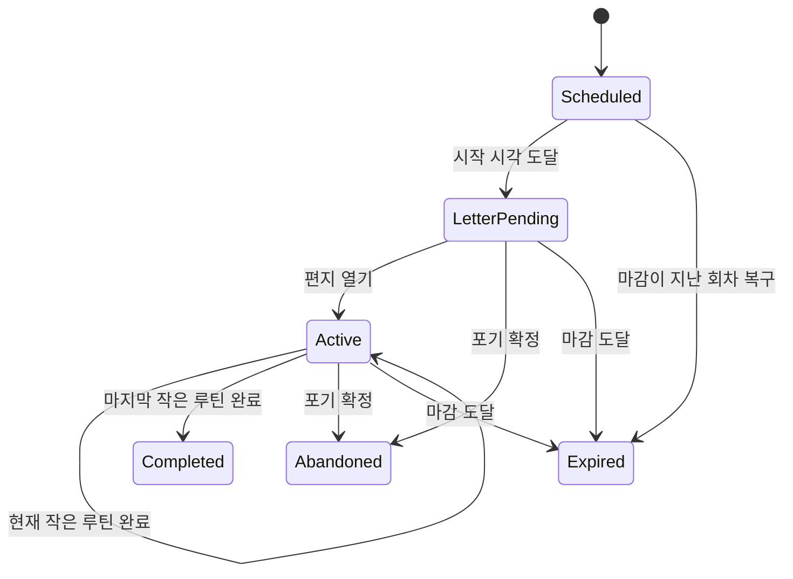

# 기능과 화면의 연결

## 핵심 구분

루틴의 실행 단계와 화면 번호는 같은 것이 아니다. 아래 흐름의 화면을 건너뛰거나 애니메이션이 끝났다는 사실만으로 제품 기록을 변경하지 않는다. 입력 의도는 `편지 열기`, `현재 작은 루틴 완료 확인`, `큰 루틴 포기 확인`처럼 표현하고 어느 실행 회차·어느 상태에서 나온 요청인지 함께 전달한다.

## 화면 참조

| 기능 | Figma 근거 | 처리 경계 |
|---|---|---|
| 홈 | 104:894 / 321:1777 | 시간·장치 상태·캐릭터 표시. 샘플 화면은 별도 diagnostics |
| 큰 루틴 알림·편지 | 104:926 / 105:1122 | 시작 시각 도달로 알림 대상이 됨. 편지를 열었다고 완료 처리하지 않음 |
| 현재 작은 루틴 | 102:2301 / 105:1231 | 포기·완료 초점 선택과 실행을 구분 |
| 완료 재확인 | 102:2425 | 확정 시점에 대상과 버전을 다시 검증 |
| 포기 재확인·결과 | 102:2470 / 102:2537 | 취소는 제품 상태를 바꾸지 않음. 확정은 별도 포기 결과 |
| 마감 경고·초과 | 102:2290 / 106:1719 | 경고 표현과 실제 마감 결과를 구분 |
| 먹이 뽑기·획득 | 105:1332 / 105:1373 | 완료로 얻은 보상 권리와 랜덤 결과의 결정·저장을 분리 |
| 먹이 주기 | 105:1391 / 105:1414 / 105:1561 | 소비·성장 반영이 한 번 확정된 뒤 연출 |
| 성장·진화 | 106:1930 / 102:2782 / 322:2413 / 102:2812 | 사용자 Figma 우선 결정으로 단계별 40/50/60 채택. 소비·성장·진화 알림 동시 저장 |
| 캐릭터·먹이 도감 | 106:2196 / 106:2311 / 106:2527 / 502:2230 | 소유 여부·선택 가능 여부와 탐색 초점 분리 |
| 하루 요약 | 102:2398 / 102:3214 | 소개/마무리와 KST 집계 연결. 자정 표시 전환과 원장 보존을 분리 |
| 등록·페어링 | 435:2166 / 435:2025 / 435:2205 | 실제 등록 계약을 받은 뒤 구현 |

Figma 링크는 `https://www.figma.com/design/ftPSckhNiwJErjkhZhV9iM/예소?node-id=<위 ID의 :를 -로 치환>` 형식으로 접근한다. 2026-10-02에 루틴·완료·포기 프레임 3개의 실제 디자인 문맥과 스크린샷을 확인했다. v0.5는 확보한 원본 자산과 같은 C++ 렌더러로 흐름을 표시한다. 전체 단계별 그림/모션이 연결된 것은 아니다.

## 루틴 엔진의 첫 구현 범위

한 번의 큰 루틴 **발생 회차**를 입력받아 상태 변화를 계산하는 순수 C++ 엔진부터 구현한다. 여러 날의 일정 수신·선택은 상위 계층의 일이며 엔진이 HTTP 응답을 직접 읽지 않는다.

완료한 작은 루틴은 각각 보상 권리를 남긴다. 완료 권리와 시간 초과·포기 결과는 함께 존재할 수 있다. 예를 들어 5개 중 2개를 끝내고 큰 루틴을 포기해도 그 2개의 완료 기록과 보상 권리를 지우지 않는다. 어떤 먹이를 줄지·언제 소비할지·얼마나 성장할지는 이 엔진의 책임이 아니다.

첫 엔진의 `Completed`는 큰 루틴의 작은 루틴을 모두 완료했다는 뜻이다. 화면에서 먹이 연출·진화·하루 요약까지 끝났다는 뜻은 아니다. 보상 미처리 상태를 포함한 후속 화면 흐름은 상위 애플리케이션이 관리한다.

## 시간 정책의 명시

자료에서 확정되지 않은 경계 조건을 숨긴 상수로 넣지 않는다. 엔진 생성 시 정책을 명시한다.

- 마감과 완료 입력이 정확히 같은 시각: `DeadlineWins` 또는 `AllowAtDeadline` 중 호출자가 선택. 제품 바인딩 전 최종 정책 확정 필요.
- 경고 시점: 초 단위 선행 시간. 0이면 비활성. 임의로 5분을 기본 설정하지 않는다.
- 시계가 신뢰되지 않으면 예약·마감·완료 시각을 확정하지 않는다. 취소·화면 탐색은 별도 UI 처리다.
- 시각이 직전 제품 전환 기록보다 역행하면 `ClockMovedBackward`로 반환한다. 매 틱의 시각을 저장·버전 갱신하는 방식은 사용하지 않는다. 시간 보정 정책이 정해지기 전 자동으로 기록을 되감지 않는다.

## 늦게 들어온 입력

각 조작 요청에는 실행 회차 ID와 화면이 참조한 상태 버전, 완료 대상 작은 루틴 ID가 포함된다. 이전 확인창의 입력, 연타, 네트워크 콜백 재전달을 다음 작은 루틴의 완료로 바꾸지 않는다. 동일 입력이 이미 반영됐다면 추가 보상 권리나 종료 이벤트가 생기지 않아야 한다.

## 오류와 복구 시나리오

| 상황 | 기대되는 구조적 처리 |
|---|---|
| 완료 계산 후 저장 실패 | 계산 결과를 공개하지 않음. 이전 메모리 상태 유지, 불확실한 쓰기는 같은 부팅에서 재시도하지 않고 복구 필요 표시 |
| 저장 후 화면 출력 전에 재부팅 | 저장한 제품 상태로 복원. 필요한 화면을 재구성 |
| 먹이 연출 도중 재부팅 | 소비 여부를 기록으로 판정. 연출 프레임으로 중복 지급하지 않음 |
| 도감 탐색 중 마감 | 엔진의 시간 처리는 계속. 화면 전환 우선순위는 별도 정책 |
| 완전 전원 차단 후 시간 미확인 | 일정·기록 보존, 시간 동기화 전 잘못된 만료 확정 방지 |
| 서버 수신 후 ACK 유실 | 같은 이벤트 ID로 재전송. 서버 계약에서 중복 방지 보장 필요 |
| 진행 중 새 일정 수신 | 현재 실행의 버전과 새 계획을 구분. 적용 정책 확정 전 덮어쓰기 금지 |
| 보관 용량 초과 | 오래된 미전송 기록을 조용히 삭제하지 않음. 용량 부족 명시 |

위 표는 설계 요구이며 전부 구현됐다는 뜻은 아니다. 실제 구현 상태는 [개발 순서](development.md)의 표에 기록한다.

## v0.5 제품 연결

완료 확인 → 완료·먹이 배정 저장 → 획득 안내 → 먹이 주기 확인 → 소비·경험치 저장 → 성장/진화 → 다음 단계 또는 결과 → 오늘 일정이 모두 끝났으면 하루 요약 순서다. 미처리 권리·진화 알림·새 캐릭터 제안은 저장 상태에서 복원한다. 도감은 소유/획득 상태에 따라 탐색·선택을 제한하며 마지막 항목은 홈 복귀다. 자세한 키 동작은 [실행 계약](product-runtime.md)을 따른다.
