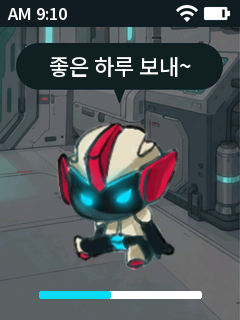

# 펌웨어 검증 기록

검증일: 2026-10-02~04. 각 차수의 수치·조작은 해당 버전의 기록이다.

## 1차 — 홈 화면·하드웨어 확인

- Figma의 대표 홈 화면 `104:894`(핑크 양), `321:1777`(검정 로봇)을 읽기 전용으로 조회했다.
- 배경·캐릭터·아이콘·말풍선을 각각 원본 자산에서 변환했다. 전체 화면 스크린샷은 펌웨어에 사용하지 않았다.
- PC에서 펌웨어와 동일한 C++ 렌더러로 240×320 이미지를 생성하고 Figma 참조와 나란히 검토했다. 주요 배치·캐릭터 비율·색 테마·문구·상단 시각·게이지 위치가 일치한다. RGB565 색 양자화와 글꼴 렌더링 차이가 남는다.
- `tools/test.ps1` 통과: 버튼 바운스·짧게/길게 누르기·부팅 중 눌림 억제·시간 카운터 순환·부저 종료·화면 버퍼 경계·게이지 초기화·시각 상태 변경.
- XIAO ESP32-S3 Plus 대상 컴파일·링크 성공: Arduino CLI 1.2.0, ESP32 core 3.3.0-alpha1. 프로그램 685,671 / 3,145,728바이트(21%), 정적 전역 데이터 22,176바이트. 153,600바이트 프레임 버퍼는 실행 시 PSRAM에 우선 할당하므로 위 정적 데이터 수치에 포함되지 않는다.
- 최초 한글 출력 경로에서 발생한 링커 오류는 중간 빌드 경로를 `%LOCALAPPDATA%/RoutineDeviceBuild/eb1dd2e02367/`로 바꿔 해결했다.
- BOOT·RESET 조작 후 COM5 USB 장치가 나타났다. esptool 조회로 ESP32-S3 revision v0.2, Flash 16MB, 내장 PSRAM 8MB를 확인했다.
- 1차 앱 바이너리 보관본: `.local/backups/validated-v1/RoutineDevice.ino.bin`, 685,808바이트. SHA-256: `5c8a175153eb2a10652fe36579b5875043db2577fbe4b1f3718c0379940ada29`. 현재 `build/firmware/`는 최신 빌드로 갱신된다.
- 업로드 전 16,777,216바이트 전체 플래시 읽기 성공. 백업: `.local/backups/device-before-first-upload-20261002.bin`. SHA-256: `8b42d94ab3b4eef16ebc8a5f857666e01eb6ae6f4fe116700f7c4e3c701f2716`.
- **COM5 업로드 성공**, esptool의 기록 데이터 해시 검증 통과, 보드 재시작 완료. 로그는 `.local/upload.log`에 저장했다.
- 기기 부팅 로그에서 `Framebuffer: 153600 bytes; PSRAM total: 8388608 bytes` 확인. USB `help` 명령에 현재 펌웨어가 응답했다.
- 기기에서 `theme dark`, `progress 100`, `time 23:59`, `time off`, `theme pink`, `progress 44`, `time 09:10` 명령 7개에 OK 응답을 확인했다. 잘못된 `progress -1`, `time 25:61` 2개는 ERR로 거부했다. 로그: `.local/runtime-check.log`. 검증 후 기본 핑크·44%·AM 9:10으로 복귀했다.
- **사용자 실물 확인 완료**: ① 핑크 양 홈 화면 정상 표시 ② D3 짧게 눌러 검정 로봇 화면 전환 ③ D3 길게 눌러 짧은 부저 울림. 세 가지 모두 정상이라는 응답을 받았다. 현재 입력 극성·부저 극성·화면 설정으로 동작함을 확인했다.

## 2차 — 설계 반영·코드 분리·루틴 엔진

- 설계의 책임 분리에 맞춰 `domain`, `presentation`, `input`, `diagnostics`, `platform/esp32`로 실제 코드를 나눴다. `.ino`는 확인 모드 구성과 setup/loop 연결만 담당한다.
- `tools/test.ps1`의 세 테스트 프로그램 모두 통과했다. 기존 버튼/부저 타이머/렌더러, 진단 입력·오버플로 후 복구, 순수 루틴 엔진을 각각 검증한다.
- 엔진은 지연된 시작 확인, 편지 열기 전 완료 거부, 순서에 맞는 완료, 같은 요청의 반복, 오래된 상태 버전/단계/회차의 거부, 완료 후 보상 권리, 포기·만료 시 이미 발생한 권리 유지, 마감 경계 두 정책, 경고 1회, 시각 역행, 버전 한도, 최대 16단계에서 이벤트 중복 없음을 검사했다.
- 저장 실패 전후를 **상태를 반영하지 않음/반영한 상태 재생성**으로 모델링해 계산·재전달을 검사했다. 실제 저장 어댑터의 정전·파일 손상 테스트는 아직 아니다.
- 두 홈 미리보기 PNG는 변경 전과 바이트 단위로 동일했다. Pink SHA-256: `cf3f1e364bdd66301c3a8036bf0325c8f8fc10f26a8a1cebc56c34810a82827b`, Dark: `5cc28cec1adc7aa1c44e517104a522fa05ca5792fad764f2d4e483b1afeec395`.
- ESP32 빌드 성공: 프로그램 659,975바이트(20%), 정적 전역 데이터 22,184바이트. 루틴 엔진 소스의 ESP32 오브젝트 생성도 확인했다. 현재 실행 모드에서 호출하지 않는 함수는 링커가 제거할 수 있다.
- 2차 앱 바이너리 보관본: `.local/backups/validated-v02/RoutineDevice.ino.bin`, 660,112바이트. SHA-256: `577f3a03c82213131212054cb8965fd9392238979b72748c39d00a9f0bf5bb66`.
- **COM5 업로드 및 기록 데이터 해시 검증 통과**. `.local/architecture-upload.log` 보관.
- 기기에서 `HARDWARE CHECK v0.2`, 프레임 버퍼 153,600바이트, PSRAM 8,388,608바이트를 확인했다. 정상 명령 6개에 OK, 범위 오류 2개와 길이 초과 1개에 ERR, 그 뒤 help 및 정상 명령 복구를 확인했다. `.local/architecture-runtime-check.log` 보관.
- 장치 상태는 핑크·44%·AM 9:10의 기본 확인 화면으로 돌려두었다. 이번 구조 버전의 버튼/부저 처리는 PC 회귀 테스트로 확인했으며 사용자의 새 실물 버튼 테스트를 받았다고 기록하지 않는다. 1차 실물 확인 이력은 위와 같다.
- 사용자는 이전 환경에서 **화면 절전까지 성공했다**고 추가로 확인했다. 새 구조 버전에서 절전을 다시 구현·검증했다는 의미는 아니며, 후속 구현에서 재현할 기준 사실로 기록했다.

## 3차 — 입력 의도·light sleep·매 기상 시간 동기화

- 사용자 요구를 반영해 `Next/Confirm/Back`과 1개/3개 버튼 매핑 함수를 구현했다. 1개 버튼은 단일 탭/두 번 탭/800ms 유지이며, 300ms 동안 두 번째 누르기를 판별한다. 화면·엔진에는 물리 핀/유지 시간을 전달하지 않는다.
- PC 테스트 **4개 실행 파일 모두 통과**. 기존 회귀 검사에 더해 두 번 누르기의 단일 탭 중복 방지, 첫 탭 뒤 길게 누르기, 두 번째 눌림 바운스, 경계 300ms, 시작/깨우기 중 눌림 억제, 시간 카운터 순환, 두 입력 구성의 같은 Intent 변환을 검사했다.
- `ClockSync`에서 부팅/매 기상 요청, 이미 Wi-Fi가 연결된 경우에도 새 NTP 요청, 늦은 콜백 무시, 최초 시각 미확인, 동기화 성공/기존 시각 유지 구분, 연결 중단·시간 응답 실패·재시도·카운터 순환을 검사했다. 이는 실제 공유기에 대한 시험이 아니라 시간/통신 상태를 주입한 PC 시험이다.
- USB 설정 명령은 최대 SSID/암호 길이, 공백 포함 문자열, 열린 네트워크, 잘못된 16진수/NUL/초과값을 검사했다. 자격 증명은 기기 로그에 출력하지 않으며 설정 도구는 로컬 숨김 입력을 사용한다.
- 최종 ESP32 컴파일/링크 성공: 프로그램 **1,250,015바이트(39%)**, 정적 전역 데이터 **46,416바이트**. 로그 `build/device-services-build.log`.
- 최종 바이너리 `build/firmware/RoutineDevice.ino.bin`, **1,250,240바이트**, SHA-256 `2b18d13661f63bceb4106b268a589b28c38c4aa2e36f945c91dcae065057abd6`.
- COM5의 USB VID 303A/PID 1001을 확인한 뒤 업로드했고 esptool 기록 해시 검증 통과. `.local/device-services-upload.log` 보관. 기존 v0.2 바이너리는 별도 백업했다.
- 초기 실제 light sleep 실행 뒤 USB 통신이 복귀하지 않는 현상을 확인했다. **사용자는 이때 화면이 켜져 있고 D3으로 테마도 바뀐다고 확인했다.** USB 로그 단절을 화면 절전 실패로 취급하지 않았다.
- 진단 런타임에서 절전 전 USB CDC를 닫고 복귀 후 다시 열도록 수정했다. 또한 Windows `SerialPort`의 모뎀선 설정이 리셋을 유발하는 경로를 피하도록 `DeviceConsole.ps1`을 추가했다. 단순 DTR/RTS 변경으로는 반복 시험이 실패했으며, 최종 도구는 모뎀선을 변경하지 않는 Win32 파일 핸들로 CDC를 읽고 쓴다.
- 최종 `tools/test-power.ps1 -Port COM5` **실제 기기 3회 연속 통과**. 각 2초 타이머 절전 후 `last-error=0`, `wake-cause=4`(타이머)를 확인했다. 동기화 요청 횟수가 **1 → 2 → 3 → 4**로 유지·증가해 보드 리셋 없이 매 복귀 요청이 호출됨을 확인했다. 매회 USB를 케이블 재연결 없이 다시 열었다. 로그 `.local/device-services-power-check.log`.
- 최종 일반 시리얼 도구로도 요청 횟수 4가 유지됨을 확인했다. 정상 화면 명령/실시간 시각 표시 복귀는 수락하고 잘못된 sleep/idle/Wi-Fi 설정 명령 4개는 거부했다. 로그 `.local/device-services-final-runtime.log`.
- 기기는 핑크·44% 샘플 성장·시스템 시계 표시로 두었고 자동 절전은 기본 `idle off`다. Wi-Fi 미설정이므로 시각은 `--:--`이며 `known=0 fresh=0 configured=0 successes=0`이다. **새 시간 수신/실제 공유기 재접속/자격 증명 재부팅 보존은 최초 Wi-Fi 설정 후 확인할 항목**이다. 성공한 것으로 기록하지 않는다.
- 새 두 번 누르기의 사용감, 절전 중 D3 자체로 깨우기, 배터리 전류/사용 시간, 긴 오프라인 뒤 시간 보정, 최종 제품 예약/영구 상태와의 통합은 별도 실물 검증 대상이다. 사용자 화면 확인은 타이머 복귀 후 화면/버튼 동작에 대한 확인이다.

## 4차 — 제품 흐름·저장·세 입력 (2026-10-03)

- 기본 진입점을 Product v0.4로 변경했다. 물리 제스처는 한 번=Next, 두 번=Previous, 800ms=Confirm이다. 3개 버튼의 매핑은 왼쪽/가운데/오른쪽=Previous/Confirm/Next이며 추가 GPIO 배선은 아직이다.
- 5개 PC 테스트 실행 파일 통과. 순수 엔진뿐 아니라 컨트롤러의 편지→완료 확인→보상 안내→다음 단계/결과, 포기 취소/확정, 확인 중 마감·경고 경합, 시각 미확정·역행, 중복 일정, 저장 실패/부분 쓰기/불확실한 성공, 복원, CRC·모든 바이트 변조·절단, 전송 순서/용량, 한국 날짜별 순서 계산을 검사했다.
- 호스트 JSON→USB 바이너리→C++ 코덱→일정 import/중복 import를 연결한 PC 검사 통과. 실제 기기에 가짜 일정을 제품 데이터로 넣지는 않았다.
- 원본 Figma 편지·루틴·완료/포기 확인·도감 자산으로 9개 PC 화면을 출력했다. 최신 `product-1.png`의 제목 작은 단계 1/2와 하루 큰 루틴 전체 1/1을 구분해 확인했다. 포기 확인의 취소/확인 선택과 긴 한국어 줄바꿈을 검토했다. 운영 오류/보상 보관 안내는 추가 화면이며 최종 디자인으로 확정한 것이 아니다.
- 최종 ESP32 빌드: 프로그램 **2,387,467바이트(75%)**, 정적 전역 **155,864바이트(47%)**. 앱 파일 **2,387,696바이트**. SHA-256 `40eaff92cfc3ae86d07efc73235bc5a219bac431cd0c3bb0d92ffeba8f985604`. `.local/backups/validated-v04/RoutineDevice.ino.bin`에 보관했다.
- 첫 실물 부팅에서 FAT 초기화 순서 결함을 발견했다. 실패한 FFat 마운트가 wear-levelling 메타데이터를 기록해 이후의 '전체 빈 영역' 검사를 통과하지 못했다. 검사와 초기화 표식 저장을 마운트 앞으로 옮겼고, 첫 generation이 확정된 뒤 자동 포맷을 금지했다.
- 수리 전에 FAT 10,354,688바이트를 `.local/backups/first-v04-fat-before-repair.bin`에 백업했다. 최초 전체 플래시 백업의 같은 영역은 전부 0xff였다. 실패 직후 변경은 FAT 상대 오프셋 0x9cb000/0x9d5000/0x9df000의 WL 메타데이터 3섹터뿐이고 RDST 원장은 없었다. 이 신규 FAT 영역(0x610000~0xFEFFFF)만 빈 상태로 되돌린 뒤 수정판을 업로드했다. NVS와 다른 파티션을 전체 초기화하지 않았다.
- 최종 COM5 업로드·기록 해시 검증 통과. `.local/product-v04-upload.log` 보관. 새 기기 최초 빈 원장 generation=1 저장 성공, USB reboot 후 **storage-mounted=1 load=1 generation=1 fault=0** 확인. `.local/product-v04-reboot.log` 보관. 이는 빈 원장의 실제 저장/복원 검증이며 완료된 루틴의 물리 정전 시험과 구분한다.
- USB input previous/next/confirm을 제품 입력 경계에 전달해 홈(0)→도감 선택(7)→먹이 안내(9)→선택(7)→캐릭터(8)→홈(0)과 커서 변화를 확인했다. 물리 D3 사용감에 대한 새 사용자 확인을 대신하지 않는다.
- 사용자 실물 추가 확인: D3 한 번으로 도감 선택창이 열리고, 최초 캐릭터 선택 상태에서 길게 눌러 양·'좋은 하루 보내' 배경과 '캐릭터 미리보기', '>확인' 화면에 진입했다. 이는 현재 구현의 캐릭터 미리보기 화면이며 정식 소유 도감 완성이 아니다. 초기 선택이 이미 캐릭터라 이번 안내 순서로는 두 번 누르기의 선택 이동을 독립적으로 검증할 수 없었다. 이를 세 제스처 전체 실물 통과로 기록하지 않는다. 이동 검증 순서는 도감에서 한 번→먹이, 두 번→캐릭터다.
- 제품 모드에서 2초 타이머 절전 **3회 연속 통과**. requests **1→2→3→4**, 매회 `last-error=0 wake-cause=4`, USB 재연결, generation=1/fault=0 유지. `.local/product-v04-power.log` 보관. 최종 free heap 184,772바이트. 보드 리셋 없이 요청 횟수가 유지됐다.
- 종료 상태는 빈 일정의 홈, 개발용 `idle off`, Wi-Fi 미설정이다. `configured=0 known=0 fresh=0 successes=0`이므로 실제 NTP 수신을 검증했다고 표현하지 않는다. 시각은 --:--가 정상이다. 재부팅하면 기본 무조작 60초로 돌아간다.
- 새로운 UX PDF/Notion을 읽었으며 실제 서버는 호출하지 않았다. 성장 40/50/60 대 10/20/30, 먹이 대 완료 sync, 배터리 필수/실측 없음, 부분 ACK 등 차이는 [자료 대조](docs/source-review-2026-10-03.md)에 기록했다.

## 5차 — Figma 성장·먹이 소비·도감·하루 요약 (2026-10-03)

- 사용자 'Figma를 최우선으로' 결정에 따라 단계 목표 **40·50·60**, 누적 **40·90·150**을 적용했다. 서버의 누적 10·20·30은 구현 기준에서 제외하고 연동 충돌로 보존했다.
- `tools/test.ps1` **5개 실행 파일 모두 통과**. 150회 먹이 소비의 단계 경계, 진화 알림 중 중복 소비 거절, 소비와 성장의 동시 저장, 저장 실패 시 미반영, 진화 직후 재시작, 새 캐릭터 소유/선택, 미완성 진행 보존, 완성 캐릭터 다시 키우기를 확인했다.
- 하루 요약의 KST 날짜 분리, 미래 일정 제외, 자정의 오래된 입력 무효화, 기존 완료 기록 보존, 요약 완료 후 홈 복귀를 검사했다. 캐릭터 잠금과 도감 끝의 홈 복귀도 포함했다.
- 실제 v1 형식의 독립 바이너리 fixture에서 완료·안내 확인 기록을 읽어 먹이를 배정하고 v2로 저장한 뒤 소비·재시작해도 재추첨/중복 경험치가 없는지 확인했다. v2에서 완료 먹이 ID가 빠진 데이터는 CRC를 다시 맞춰도 거절했다. 이는 PC의 이전 형식 이행 검사다.
- 호스트 JSON → 기존 v1 USB 전달 형식 → 새 C++ 코덱 → 일정 import/중복 import 호환 검사 통과. 기기에 가짜 RTC·일정·경험치·완료 기록을 주입하지 않았다.
- 동일 C++ 렌더러로 20개 240×320 화면을 출력하고 `design/previews/product-v05-contact.png`를 시각 검토했다. 긴 인사말의 고립된 마지막 글자와 버튼 뒤 불필요한 게이지를 수정했다. 이 그림의 진행량은 PC 전용 시각 fixture이며 기기의 실제 진행량이 아니다. 상세 요약 패널과 일부 도감 배치는 구현 화면이고 전체 Figma 픽셀 일치를 주장하지 않는다.
- 최종 ESP32 빌드: 프로그램 **2,408,319바이트(76%)**, 정적 전역 **156,736바이트(47%)**. 앱 파일 **2,408,544바이트**. SHA-256 `8c44c3dd69c1c89885665c24ebff9ff8d6a776a84d571d1b1dca1534c97515e4`. 빌드 로그 `build/product-v05-build.log`, 바이너리 보관 `.local/backups/validated-v05/RoutineDevice.ino.bin`.
- **COM5 업로드 및 기록 해시 검증 통과**. `.local/product-v05-upload.log`. 기존 FAT/NVS를 지우거나 포맷하지 않았다. 업로드 전 v0.4 generation=1, 일정/이벤트 0개를 확인했고 새 부팅에서도 generation=1, fault=0, 몽실이 1단계 0/40으로 복원했다.
- USB의 동일 Previous/Next/Confirm 경계로 캐릭터 도감의 잠긴 또비 선택 거절, 도감 끝 홈 복귀, 먹이 첫 항목에서 Previous로 홈 항목(item=31) 이동, 캐릭터 확인창의 취소 기본 선택을 확인했다. 현재 몽실이를 다시 선택하여 제품 진행량을 바꾸지 않고 **generation=2의 스키마 2 저장**을 실행했다. 검사 스크립트의 CharacterConfirm 예상 번호를 실제 enum 16으로 바로잡고 기록된 순서를 대조했다. 펌웨어 전환 오류는 아니었다. 로그 `.local/product-v05-navigation.log`.
- USB reboot 후 `PRODUCT v0.5 storage-mounted=1 load=1`, **generation=2 revision=0 runs=0 events=0 fault=0**, 몽실이 0/40 복원을 확인했다. `.local/product-v05-reboot-command.log`, `.local/product-v05-reboot.log`. 기존 v1 빈 원장 → v2 저장 → 재시작의 실제 검증이며 완료/소비 중 물리 정전 시험은 아니다.
- 2초 타이머 절전 **3회 연속 통과**. requests **1→2→3→4**, `last-error=0 wake-cause=4`, USB 재연결, generation=2/성장 0/40 유지. `.local/product-v05-power.log`. 최종 free heap **183,900바이트**.
- 종료 상태: 빈 일정의 홈, 몽실이 1단계 0/40, 개발용 `idle off`, `configured=0 known=0 fresh=0 successes=0`. 실제 공유기/NTP 수신, 실제 일정의 먹이·진화·하루 요약 실물 전체 흐름은 아직 검증하지 않았다. D3 제스처 처리는 PC 회귀 검사를 통과했으며 이번 화면에 대한 새로운 사용자 실물 확인을 받은 것은 아니다.
- 운영용 일정 교체·누적 도감 보관은 남아 있다. 한 묶음은 최대 64단계여서 새 기기의 150회 육성에는 이 작업이 필요하다. 캐릭터 그림은 몽실이·또비 2종, 먹이 이름은 31종이지만 그림은 블루베리만 연결했다. 전체 캐릭터/단계별 진화 모션과 실서버 성장 조정은 완료로 표기하지 않는다.

## v0.5 글꼴 보정 — 홈 성장 수치·하단 안내 (2026-10-03)

- 사용자가 실물의 '1단계 0/40', '아직 일정이 없어요'가 자글자글하다고 알려줬다. 해당 문구가 22px 1비트 한글 글꼴을 18px/13px로 최근접 축소하는 경로임을 확인했다.
- 성장 수치는 원래 크기인 18px, 홈 하단의 세 안내 문구는 14px에서 생성한 Noto Sans KR 500의 8비트 알파 글리프로 교체했다. 모든 숫자와 단계/구분자를 포함해 진행량이 바뀌어도 같은 품질로 표시한다. 안내 문구는 13px에서 14px로 키웠다. 전체 한글 글꼴이나 파티션을 늘리지 않았다.
- 기존 PC 검사 5종 통과. 제품 렌더링 미리보기에 빈 일정의 홈을 추가했다. `design/previews/home-text-comparison.png`의 실제 240×320 출력과 최근접 확대본을 비교해 획의 끊김/불균일 감소를 확인했다. 변경 픽셀은 하단 `(65,270)~(175,317)` 안에만 있었으며 안내 영역의 색은 2개에서 62개로 늘어 가장자리 알파 혼합을 확인했다. 실물 가독성에 대한 새 사용자 평가는 아직이다.
- 빌드 성공: 프로그램 **2,414,607바이트**, 정적 전역 **156,736바이트**. 앱 **2,414,832바이트**, SHA-256 `472d34a0fa7ebb4d3a178f5a522fd16513d9e3c731eb7c5dd177417c7657703d`. `build/home-text-build.log`, `.local/backups/validated-v05-text/RoutineDevice.ino.bin`에 보관.
- COM5 업로드·해시 검증 통과. 재시작 후 **generation=2 revision=0 runs=0 events=0 fault=0**, 몽실이 1단계 0/40을 확인했다. 저장 형식과 제품 기록을 변경하지 않았다. 로그 `.local/home-text-upload.log`, `.local/home-text-after-status.log`. 개발용 `idle off` 상태다. 표시 변경이므로 기존 절전/시계 시험을 반복하지 않았다.

## v0.5 리팩토링 — 입력·표시·보상 책임 분리 (2026-10-03)

- 사용자 리팩토링 요청에 따라 화면 데이터를 `ProductView.h`, 화면별 입력을 `ProductInput.cpp`, 먹이 배정/조회 공통 함수를 `RewardLedger.*`, 글꼴/이미지/픽셀 처리를 `Drawing.*`로 분리했다. 화면별 배치는 이름 있는 함수로 나눴다. 상태 소유자와 `candidate_` → `commit()` 저장 확정 순서는 그대로다.
- 기존 5개 PC 검사 통과. 보상 조회에 대해 안내 확인과 소비 구분, 소비한 종류 건너뛰기, 여러 회차에서 선택한 먹이 찾기, 이미 배정된 먹이와 난수 상태를 재배정하지 않는 검사를 추가했다. v1 이행·v2 코덱·실패 저장·진화·자정 경합 검사도 유지했다.
- 변경 전 실행 파일과 소스 일부를 `.local/refactor-before/`에 보관했다. 같은 21개 화면을 변경 전후 렌더해 **출력 바이트 전부 일치**를 확인했다. 홈의 18px/14px 글꼴 보정도 포함한다. 개별 해시는 `.local/refactor-screen-comparison.json`이다.
- 독립 비교 드라이버에서 32가지 초기 성장 상태/저장 실패 조건에 각각 640개 입력·시각 변경·재시작을 적용했다. **20,480개 처리 결과의 화면 데이터·제품/저장 데이터 체크섬·저장 횟수·알림·절전 시간·오류 상태가 변경 전과 일치**했다. 실제 전원 차단/네트워크 시험이 아닌 PC 메모리 저장소 비교다. 전체 화면 분기 중 새 캐릭터 선택은 기존 개별 진화 검사로 확인했다.
- 비교 기록 `.local/refactor-before.trace`와 `.local/refactor-after.trace`의 SHA-256은 모두 `12f712f47dc83c01e982db42428cdc5600fd05493a99b9db64ecc5991a558fff`다. 드라이버는 `.local/refactor_parity.cpp`에 보관했다.
- 호스트 JSON → v1 개발용 전달 형식 → 새 C++ 일정 import/중복 import 검사도 통과했다. 저장 형식 v2, 성장 정책, D3/세 버튼 매핑, 절전 요구는 변경하지 않았다.
- ESP32 빌드 성공: 프로그램 **2,415,403바이트(76%)**, 정적 전역 **156,736바이트(이전과 동일)**. 앱 **2,415,632바이트**, SHA-256 `5ca29bed328c6934b45fec62f9dce755a1b148a22ab8a54182fb20ff11b88009`. `build/refactor-build.log`, `.local/backups/validated-v05-refactor/RoutineDevice.ino.bin`에 보관했다.
- **COM5 업로드·기록 해시 검증 통과**. 기존 데이터의 generation=2, revision=0, runs=0, events=0, 몽실이 1단계 0/40, fault=0 복원을 확인했다. `.local/refactor-upload.log`, `.local/refactor-after-status.log`.
- 실제 기기에 USB로 동일 입력 의도를 전달해 도감 선택 이동, 확인창 취소, 잠긴 캐릭터 선택 거절, 먹이 도감 끝 항목으로 순환, 홈 복귀를 확인했다. 모든 단계에서 generation=2를 유지해 이 조작으로 제품 저장이 발생하지 않았음을 확인했다. `.local/refactor-navigation.log`, 실행 도구 `.local/refactor-device-smoke.ps1`. 이는 실제 D3의 새로운 사용자 조작/시각 평가를 대신하지 않는다. 종료는 빈 일정 홈과 개발용 `idle off`다.

## v0.5 도감 표시 수정 (2026-10-04)

- Figma `106:2527`, `466:2350`, `321:3569`를 브라우저에서 읽기 전용으로 직접 대조했다. 홈 배경을 재사용했던 임시 도감을 전용 흰 배경·테마 카드·상단 제목/번호·좌우 화살표·알약 버튼으로 교체했다. 비교 자료는 `design/previews/catalog-reference-comparison.png`다. 번호/이름/버튼/보유량은 표시 크기의 안티앨리어싱 글꼴이며 도감 선택창의 인사말/안내 제목도 보정했다.
- 몽실이 1단계에는 이미 보관한 아기 양 원본을 사용하고, 블루베리는 도감 원본 크기에 맞춰 배치했다. 새 `CatalogRenderer.*`는 제품 상태를 읽기만 한다. 자산/글꼴은 `generate_catalog_assets.py`로 재생성할 수 있다. 전체 Figma 스크린샷은 펌웨어에 넣지 않았다.
- 기존 PC 검사 5종 모두 통과했다. 마지막 표시 조정 후 제품 검사도 다시 통과했다. 21개 화면 중 **도감 선택/캐릭터/캐릭터 확인/먹이/먹이 상세 5개만 픽셀이 변경**되었고 나머지 16개는 직전 리팩토링 출력과 바이트가 일치했다. 홈의 작은 글씨 보정도 유지됐다.
- 두 테마 × 먹이 31개·먹이 홈·캐릭터/잠금/홈의 **70개 PC 렌더 상태**에서 버퍼 양끝을 보존했다. `design/previews/catalog-states.png`로 긴 이름, 잠금, 테마, 복귀를 시각 검토했다. 원본의 50칸/성장 단계별 독립 항목은 아직 구현하지 않았으며 현재 두 캐릭터만 표시한다. 연결하지 않은 먹이 그림을 잠금으로 오인하지 않도록, 획득한 항목은 이름과 선택 버튼을 표시하고 그림 영역은 비워 둔다.
- 업로드 전 실제 기기: COM5, generation=2, revision=0, runs=0, events=0, 몽실이 1단계 0/40, fault=0. `.local/catalog-before-status.log` 보관.
- 최종 ESP32 빌드: 프로그램 **2,618,891바이트(83%)**, 정적 전역 **156,736바이트(기존과 동일)**. 앱 **2,619,120바이트**, SHA-256 `f87bfa308e80e0edd52bca2d8f6595fbda0890e2e80b0b77b15119889d601ef2`. `build/catalog-final-build.log`, `.local/backups/validated-v05-catalog/RoutineDevice.ino.bin`에 보관했다. 최종 소스와 Arduino 중간 소스는 자동 삽입된 `#line` 이외에 동일하다.
- **COM5 업로드·기록 해시 검증 통과**. 기기 재시작 후 generation=2, 몽실이 0/40, fault=0 복원을 확인했다. 동일 USB 입력 경계로 도감 선택, 확인 취소, 잠긴 캐릭터 선택 거절, 먹이 끝 항목, 홈 복귀를 확인했고 모든 단계에서 generation=2를 유지했다. `.local/catalog-upload.log`, `.local/catalog-after-status.log`, `.local/catalog-navigation.log`에 보관했다.
- 종료는 **캐릭터 도감(screen=8, item=0)**, 개발용 `idle off`다. `.local/catalog-final-status.log`. 이번 LCD 화면에 대한 사용자 시각 확인은 아직이며, 실제 D3·NTP·절전 시험을 새로 반복했다고 주장하지 않는다. UI 변경과 무관한 저장/시간 규칙은 유지했다.

## v0.5 도감 원본·성장 단계 연결 (2026-10-04)

- Figma 플러그인 연결 후 45개 프레임의 디자인 문맥·스크린샷, 개별 자산 136개를 읽기 전용으로 받았다. `design/catalog-assets.json`에 URL·원본 해시, `design/catalog-geometry.json`에 슬롯·회전·크롭·이름 위치를 기록했다. 전체 스크린샷은 비교용으로만 사용한다.
- 몽실이/또비의 각 3단계와 잠금 원본, 먹이 31종, 화살표·상단 SVG를 연결했다. 카드/버튼 위치·곡률·글꼴을 대조하고 확인창에서 원본에 없는 흐림을 제거했다. `design/previews/catalog-direct/figma-comparison.png`와 `foods.png`를 육안 검토했다. 확인창의 옛 임시 캐릭터/이름은 현재 선택한 카드의 실제 데이터로 표시한다.
- 단계별 도감 인덱스와 종 ID를 분리했다. 도달한 최고 단계는 별도 저장하여 다시 키우기 후에도 남는다. 쓰기 스키마는 3, 읽기는 1·2·3이다. 코드 변경 전 기존 v2 인코더로 만든 독립 fixture `tests/fixtures/state-v2-collection.bin`으로 이행을 검사했다. 현재 성장량·난수·요약 날짜 보존, v2/v3 두 슬롯 혼재 시 최신 정상 기록 복원, 완성 후 초기화·재부팅 후 수집 유지, 취소 시 카드/저장 세대 보존, 저장 실패 시 미확정을 확인했다.
- PC 검사 6종 통과. `catalog-tests`에서 이미지 54개 복원, 잘린/잘못된 참조·초과 길이 스트림 거절, 두 테마 × 획득/잠금 × 도감/확인/상세/홈 총 **312개 렌더 상태의 버퍼 경계**를 검사했다. 성장 경계 40·90·150, 단일/이중/긴 입력, 매 기상 동기화 요청 검사는 유지됐다. 기존 JSON → v1 전달 형식 → 현재 코덱 → 일정 import/중복 import도 통과했다.
- `tools/verify_catalog.py`는 실제 C++ 출력 이미지 **54개 모두**가 원본 변환 PNG의 RGB565/알파 합성 결과와 픽셀 단위로 일치함을 확인했다. 홈 두 배경·제품 이미지도 같은 무손실 압축 경로로 바꿨다. 단일 UI 루프의 4KiB 고정 복원 버퍼를 사용하며 힙 할당은 없다. 이전 21개 화면 중 **도감 관련 4개만 변경**, 나머지 **17개는 출력 바이트 일치**다. 홈 작은 글씨 보정도 유지됐다. `build/catalog-direct/verification.json`에 보관했다.
- 직접 확인한 캐릭터 콘텐츠는 2종 × 3단계, 먹이는 31종이다. `/50`은 Figma의 목표 분모이며 50종을 구현했다는 의미가 아니다. 도감 외 홈/성장/먹이 연출의 새 자산 연결은 이번 범위에 포함하지 않는다. PC 미리보기의 모든 획득 상태는 가상 fixture이고 실제 기기에 보상을 주입하지 않았다.
- ESP32 최종 빌드 성공: 프로그램 **2,948,543바이트(93%)**, 정적 전역 **161,056바이트(49%)**. 앱 **2,948,768바이트**, SHA-256 `c61e1328420d3fb95f90742b6192d3ccd111649f6e83983c688b49ebfe1c6f3d`. `build/catalog-direct-build.log`, `.local/backups/validated-v05-catalog-direct/RoutineDevice.ino.bin`에 보관했다. Arduino에 복사된 소스 55개가 현재 소스와 `#line` 삽입 이외에 모두 같음을 확인했다.
- **COM5 업로드와 기록 해시 검증 성공**. 기존 파티션 배치를 유지하고 FAT/NVS를 지우지 않았다. 업로드 후 generation=2, revision=0, runs=0, events=0, 몽실이 1단계 0/40, fault=0 복원 확인. 현재 캐릭터를 그대로 선택하는 정상 확인 동작으로 v3 generation=3을 저장한 뒤 USB `reboot`를 실행했고, generation=3과 같은 진행량·fault=0을 복원했다. `.local/catalog-direct-upload.log`, `catalog-direct-after-save.log`, `catalog-direct-after-reboot.log` 참고.
- 실제 장치에서 USB로 Previous/Next/Confirm을 전달해 **6개 단계 카드 탐색, 미수집 단계/다른 종 선택 거절, 확인 취소, 양쪽 도감의 홈 항목, 재부팅 후 동일 탐색**을 검증했다. 마지막 탐색은 generation=3을 유지했다. 검증 도구는 빠른 USB 응답이 일부 잘릴 때 입력을 재실행하지 않고 `status`로 결과를 다시 확인하도록 보완했다. `.local/catalog-direct-device-smoke.ps1`, `.local/catalog-direct-navigation-3.log`에 최종 통과 기록이 있다.
- 종료 상태: **캐릭터 도감 screen=8/item=0**, 몽실이 0/40, generation=3, fault=0, 개발용 idle off, free heap 154,504바이트. `.local/catalog-direct-final-status.log`. LCD의 새 화면에 대한 사용자 시각 확인과 실제 D3 조작은 아직 새로 받지 않았다. Wi-Fi 미설정·NTP 미성공 상태이며 실제 절전/전류를 이번 변경에서 다시 시험한 것으로 확대하지 않는다.

## 검증 범위와 남은 작업

- 이번 펌웨어의 부팅·시리얼 응답은 도구로 확인했고 LCD·버튼·부저 동작은 사용자가 실물에서 확인했다. 이 결과는 이전 환경의 하드웨어 테스트와 별개의 이번 빌드 검증 결과다.
- 초기 COM4·COM6·COM7·COM9는 모두 Bluetooth 직렬 포트였다. 다운로드 모드로 전환한 기기는 별도의 COM5로 확인됐다.
- 루틴 상태 변화·먹이 배정/소비·성장·소유 도감·하루 요약·영구 저장을 연결했다. PC 규칙 검증과 실물 전체 시나리오 검증은 구분한다. 운영용 일정 갱신, 전체 콘텐츠/모션, 실제 API 연결은 남아 있다. 자세한 상태는 [개발 순서](docs/development.md)와 [실행 계약](docs/product-runtime.md)에 기록했다.
- LCD 전체 전송 중에는 입력 샘플링이 잠시 멈춘다. 화면이 바뀌는 순간의 매우 짧은 탭은 놓칠 수 있다. 현재는 화면 변경 때만 전송하며, 부저가 켜진 동안에는 전송을 미뤄 울림이 길어지지 않게 했다.
- 배터리 사용 시간/전류, 실제 NTP 수신·공유기 연결, 충전 상태, 장시간 안정성은 아직 검증하지 않았다. light sleep 타이머 복귀·화면/버튼 복귀·매 기상 동기화 요청·USB 재연결은 위 3차 범위에서 확인했다.

## 미리보기

| 핑크 양 | 검정 로봇 |
|---|---|
|  |  |
## v0.6 — 10종·30단계 / 테마 / 이미지 묶음 (2026-10-04)

- 사용자 확정에 따라 10종 × 3단계, `/30` 적용. ID 0·1 및 상태 스키마 3 유지. 컬러 30개/잠금 14개를 연결하고 미확보 잠금 16개는 물음표 대체로 명시했다.
- 추가 Figma 문맥 50노드/원본 자산 105개를 읽기 전용으로 보관했다. 홈 10종, 상단/카드/버튼/화살표/성장 막대의 테마를 연결했다. 홈 하단 추가 패널과 단계/일정 없음 문구를 제거했다. `design/previews/ten-characters`의 홈·컬러 30개·잠금 30칸 시트를 육안 대조했다.
- PC **7개 실행 파일 통과**: 기존 입력·절전 후 NTP 요청·루틴/보상/저장/이행 검사에 더해 10종 모두 150회 육성/다음 종 제안/전체 수집 저장 복원, 30카드 순환/홈 복귀, 유휴 홈 Confirm 유지, **2,520개 도감 화면** 경계 검사와 홈 10종 하단 픽셀 검사를 수행했다. `build/ten-characters-tests.log`.
- 이미지 묶음 **116개**, **2,329,579바이트**, payload CRC32 `e37dd7ae`. `tools/verify_theme_assets.py`로 모든 항목을 별도 복호화해 변환 PNG의 RGB565/알파/크롭과 일치함을 확인했다. 잘린 헤더/본문·CRC 변경·버전 불일치·크기/오프셋 넘침 거절, 거절된 교체가 기존 메모리 묶음을 유지함을 검사했다.
- `tools/preview.ps1`도 새 묶음 로더로 통과했다. PC 검토용 시각/전체 수집 fixture는 실물 진행 상태에 주입하지 않는다.
- 처음 보드 빌드에서 ESP32의 `uint32_t`와 `unsigned` 추론 차이를 발견해 USB 청크 크기 계산의 타입을 명시했다. 아래에 최종 빌드·실물 결과를 별도로 기록한다.

- 최초 v0.6 ESP32 컴파일 성공: 프로그램 **1,930,067/3,145,728바이트(61%)**, 정적 전역 **165,192바이트**. 이전 이미지 내장 버전의 93%에서 이미지 분리 후 61%로 줄었다. 앱 파일 1,930,304바이트, SHA-256 `9c336d293baeb75eeeaf3030fe955c7a59ec2ad5f6fdc13cd8aa85773cfe162d`. 당시 원본과 빌드 캐시 소스 62개가 `#line`을 제외하고 일치했다. 아래 USB 수정 버전이 최종 배포본이다.
- **COM5 펌웨어 업로드·기록 해시 검증 성공**. 초기 부팅에서 기존 generation=3, 일정/이벤트=0, 선택=0, 1단계 0/40, fault=0 보존. 새 이미지 묶음이 아직 없는 상태를 `ASSETS ready=0`으로 보고하고 입력을 `ERR assets missing`으로 거절했다. 원장을 초기화하지 않고 USB 설치 경로를 유지함을 확인했다. `.local/ten-characters-upload.log`, `.local/ten-characters-before-assets.log`.

- 첫 이미지 설치는 4KiB 청크 ACK가 오지 않아 중단됐다. 실제 HWCDC 기본 수신 큐가 256바이트였고, 전송 명령마다 LCD를 갱신하고 있었다. 타임아웃 뒤 `received=0 active=0`, 기존 generation=3/0·40/fault=0 보존을 확인했다. 느린 전송도 중간 응답 대기로 중단되어 배포용 우회책으로 채택하지 않았다. `UsbConsole.h`에서 8192바이트 수신 큐를 부팅·절전 복귀마다 준비하고 이미지 준비 상태가 바뀔 때만 다시 그리도록 수정했다.

- 이어진 확인에서 데이터 수신은 끝났지만 ACK가 뒤늦게 나타나는 HWCDC 응답 지연도 발견했다(`ASSETS OK 57344`, `ASSETS OK 258048`이 이후 조회에서 나타남). 최종 설치 도구는 헤더/본문을 함께 전송한 뒤 수신 오프셋을 조회해 응답 지연을 복구한다. 명령·청크를 중복 실행하지 않는다. 느린 64바이트 전송은 제거했다. Windows 읽기는 모뎀선을 건드리지 않는 짧은 대기로 바꿨다.
- **최종 빌드와 업로드 성공**: 프로그램 **1,930,215바이트(61%)**, 정적 전역 165,192바이트. 앱 1,930,448바이트, SHA-256 `5a282e22d588c280bd92b255df03db629f88f63b0b5b274b3891798361fa1a43`. 소스 63개/빌드 캐시 일치. `.local/backups/validated-v06-ten-characters`, `build/ten-characters-build.log`, `.local/ten-characters-upload.log`.
- **2,329,579바이트 이미지 전체 설치·재읽기 CRC 검증·활성화 성공**. `ASSETS COMMIT OK`, `ready=1 crc=e37dd7ae active=0` 확인. `.local/ten-characters-install-assets.log`.
- 실물에서 버전/오프셋/청크 CRC 거절, 명시적 취소, 30초 무진전 타임아웃을 검사했다. 기존 검증 이미지가 `ready=1`로 남았고 generation=3, 일정/이벤트=0, 선택=0, 0/40, fault=0 유지. `.local/asset-upload-error-tests.log`.
- 동일 입력 의도를 USB로 주입하여 **30카드 전체 탐색·잠긴 항목 확인 거절·첫 카드 선택 취소·양방향 순환·두 도감의 홈 복귀·유휴 홈 Confirm 유지**를 검증했다. 소유/경험치를 시험용으로 주입하지 않았으며 generation=3 유지. `.local/ten-characters-device-navigation.log`.
- **재부팅 후 이미지 묶음과 기록 복원**, 2초 light sleep 후 `last-error=0 wake-cause=4`, NTP 요청 카운터 1→2 확인. 복귀 직후 4KiB 바이너리 청크 수신/CRC ACK 및 부분 설치 취소 후 기존 이미지 `ready=1` 유지. `.local/ten-characters-reboot.log`, `.local/asset-chunk-after-wake.log`.
- 종료 상태는 홈(screen=0), 몽실이 1단계 0/40, generation=3, 이미지 준비 완료, 개발용 `idle off`다. Wi-Fi 미설정이므로 NTP **성공**은 검사하지 않았다. 새 LCD 화면의 사용자 육안 확인, 실제 추가 버튼 배선, 정전 내구성·전류·장기 운영을 완료했다고 주장하지 않는다. 도감 밖 일부 종별 합성 화면/모션 연결은 디자이너 문서의 후속 범위다.

## v0.7 — API 어댑터·기록 보존·단계별 화면·모션 (2026-10-04)

이 절은 v0.7의 당시 검증 이력이다. 최신 결과는 아래 v0.8 절을 따른다.

- **PC 9개 실행 파일 통과**. DTO·KST/UTC·잘못된 ID/날짜/문자열·중복·부분 DONE·완료 회신 대조 ACK·소비/성장·저장 실패·과거 보관/정리·스키마 이행을 검사했다. **160일 연속 진행과 중간 재부팅, 누적 150 완성 후 다음 종 성장, 158일의 과거 보관** 시뮬레이션 포함. 입력/절전 시간 요청·도감 2,520 렌더 경계·모션 건너뛰기/재부팅의 중복 소비 방지 검사도 통과. `build/v07-tests-final.log`.
- **395개 이미지, 7,182,088바이트, payload CRC dad8398c**. 모든 항목을 별도 복호화해 변환 PNG의 크롭/RGB565/알파와 비교했다. SHA-256 `cd2d255aa1f769a21264bd56ded587c2752ca06adaf0140a70c6ebf52288f4a7`. `build/v07-pack-verification.log`, `assets/packed/manifest.json`.
- PC에서 같은 C++ 렌더러로 30단계 홈·10종 흐름·31먹이 및 편지/울기/먹기 연속 프레임을 생성해 검토했다. `design/previews/v07`. 울기 몸체/눈물의 흰 사각 배경을 확인했으며 export 원본 알파가 255인 한계로 디자이너 문서에 남겼다. 그림을 투명 원본처럼 검증 완료했다고 하지 않는다. 미추출 먹기 53개는 Figma Education MCP 호출 한도로 보류됐다.
- **ESP32 빌드/COM5 업로드/기록 해시 검증 성공**. 프로그램 2,682,463/3,145,728바이트(85%), 정적 전역 51,552바이트. 앱 파일 2,682,688바이트, SHA-256 `f6aadb89d0a324fd5b7212ddb41b50818ca63ed76061c3c37419d7408fc9ebde`. `build/v07-deploy.log`. 현재 C++/헤더 75개와 컴파일 캐시 소스가 일치함을 검사했다. 자체 함수의 컴파일러 stack-usage 최대 프레임은 1,200바이트이며 전체 호출 스택 실측값과는 다르다.
- 큰 상태/스냅샷은 PSRAM, 압축 이미지 캐시는 두 개(207,288바이트)로 분리했다. 물리 입력 수집은 별도 태스크/큐, 네트워크는 별도 작업이며 제품 상태 변경은 주 실행 흐름이 소유한다.
- 새 펌웨어 부팅 시 기존 v3 generation=3, runs/events=0, 몽실이 1단계 0/40, fault=0을 보존했다. 새 이미지 미설치 상태를 `ready=0`으로 표현한 뒤 **7,182,088바이트 전체 전송·영속 재읽기 CRC·활성화** 성공. 이후 `ready=1 crc=dad8398c active=0`. `.local/v07-before-assets.log`, `v07-install-assets.log`, `v07-after-assets.log`.
- 기기에서 USB로 같은 입력 의도를 전달해 **30카드 순환, 미수집 Confirm 거절, 선택 취소, 양방향 순환, 두 도감 홈 복귀, 유휴 홈 Confirm 유지**를 확인했다. 모든 동작 후 generation=3과 실제 진행량 유지. `.local/v07-device-navigation.log`, `v07-navigation-result.log`. 시험 일정/성장/먹이를 실물에 주입하지 않았다.
- `tools/backup-state.ps1`로 generation=3 상태를 불변 파일로 보관하고 PC에 내려받아 RDST 헤더·CRC를 검증했다. `.local/backups/state-20261004-055735/history-3.bin`. 스키마 4로 내보낸 백업이며 실제 라이브 원장을 강제로 새 세대로 저장하지 않았다. Wi-Fi/API 자격증명은 포함하지 않는다.
- **재부팅 복원 성공**: 같은 generation=3/0·40/fault=0, 이미지 ready=1. `motion off` 설정도 재부팅 뒤 유지됐고 시험 후 `motion on`으로 복원했다. `.local/v07-after-reboot.log`.
- **2초 light sleep 3회 연속 성공**: wake-cause=4, last-error=0, 요청 카운터 1→2→3→4, USB 포트를 다시 열어도 보드 재부팅 없이 RAM 유지. `.local/v07-power-test.log`. Wi-Fi 미설정이므로 새 **NTP 요청**을 검증했으며 NTP 수신 성공은 아니다.
- 종료 상태는 홈, generation=3, 몽실이 1단계 0/40, fault=0, assets ready=1, motion=1, 개발용 idle off. free heap 275,824바이트, free PSRAM 7,412,880바이트. FAT total=10,235,904/used=9,527,296바이트(이전 2.33MB 자산+새 자산+진행/백업 포함). `.local/v07-final-status.log`.
- 배포 바이너리/묶음/해시는 `.local/backups/validated-v07-api-motion`에 보관했다. 생성된 merged.bin은 빌드 산출물이며 실제 기기의 NVS/FAT 전체 백업으로 간주하지 않는다. 진행 기록 백업은 위 history 파일이다.
- 실제 서버 주소·신뢰 인증서·등록 코드·Wi-Fi가 없고 현 배선에서 battery 실측값도 없으므로 **실서버 HTTP 왕복은 실행/검증하지 않았다**. 서버 성장 10/20/30과 Figma 40/50/60 충돌, 삭제/진행 중 수정/등록 복구/기기 성장 조회 계약은 서버 전달 문서에 남겼다. 새 빌드의 LCD 육안·물리 D3 조작 확인은 사용자에게 별도로 요청했다. 물리 정전/충전/전류/장시간 실물 안정성은 미검증이다.

## v0.8 — 문서 재검토·동기화 화면 보존·입력·백업 (2026-10-05)

- 보관된 Notion claim/sync 원문, 기획 기준, 화면 흐름, 설계와 두 팀 전달 문서를 다시 대조했다. 이번 작업에서 Figma를 수정하거나 최신 Figma/실서버를 새로 조회한 것은 아니다. serverTime을 RTC에 반영한다는 명세와 현재 NTP 시간 기준의 차이를 [서버·앱 문서](docs/server-app-handoff.md)에 추가했다.
- 내일 일정 수신만으로 도감 선택창이 닫히는 오류를 회귀 검사에서 먼저 재현한 뒤 수정했다. ACK만 온 경우 완료 확인창 유지, 실제 현재 단계의 서버 DONE에는 확인창 무효화, 과거 원장 정리로 배열 위치가 달라져도 같은 회차 화면 유지까지 검사했다.
- 실제 LCD에 표시한 화면 식별자를 물리 입력 큐에 연결했다. 선택/대상/단계 변경과 화면 전송 중 시작한 조작을 구분하고, 늦은 연출 건너뛰기 입력이 다음 화면의 확인으로 바뀌는 것을 막았다. 제스처 매핑과 성장 규칙은 유지했다. 이 경합의 회귀 검사는 PC 검사이며 새 D3 육안/조작 확인을 받았다는 뜻은 아니다.
- **PC 10개 실행 파일 모두 통과**. JSON 뒤 추가 데이터·NUL·문자열 종료 문자, claim 변환, 마감 포함 구간 겹침, 최대 16×16 단계/완료 이벤트의 실제 인코딩·복원, 모션 설정 전환, 불변 과거 파일의 실패/중단/충돌 보존을 추가했다. 기존 160일 진행·진화·재시작·ACK·보관, 2,520개 도감 렌더와 자산 검사를 유지했다. `build/v08-tests-final.log`.
- 백업 도구의 별도 프로세스 검사도 통과했다. 스키마 1/2의 복수 파일, 기존 동일 파일 재사용, 다른 PC 내용 보존, 손상 전송·불완전 목록 거절, 지연된 USB 응답 회복과 스냅샷 명령 중복 방지를 검사했다. **Windows PowerShell 5.1과 PowerShell 7 양쪽 통과**. `build/v08-backup-tool-windows-powershell.log`, `build/v08-backup-tool-tests-final.log`.
- **ESP32 빌드/COM5 업로드/플래시 기록 해시 검증 성공**. 프로그램 **2,684,531/3,145,728바이트(85%)**, 정적 전역 51,552바이트. 앱 파일 **2,684,768바이트**, SHA-256 `1fad82633049690866bb3f6dbba323d0a93887353449f864e8ca71d8587ed772`. `build/v08-deploy.log`. 컴파일러가 보고한 자체 함수의 최대 개별 스택 프레임은 1,200바이트이며 전체 호출 스택 실측값은 아니다.
- `tools/verify-build.ps1`로 진입점 포함 **82개 소스와 Arduino 빌드 캐시 일치**, 캐시/내보낸 앱 바이너리 일치, 이미지 묶음 헤더/descriptor 일치와 SHA-256을 기록했다. `build/v08-build-verification.json`. 이미지 395개/7,182,088바이트/payload CRC dad8398c는 v0.7과 같으며 이번에 다시 설치하지 않았다.
- 업로드 뒤 자동 타이머 복귀 후 USB를 다시 열어 기존 **generation=3, revision=0, runs/events=0, 몽실이 1단계 0/40, fault=0, assets ready=1**을 확인했다. `.local/v08-after-upload.log`. 화면 자산/진행 기록/NVS를 초기화하지 않았다.
- `backup-state.ps1 -All`로 실제 기기의 최종 과거 파일 목록 1개를 내보냈다. `.local/backups/state-20261005-144029-251/history-3.bin`, **334바이트**, SHA-256 `585055590b0b2309183e22753c36b05d5a2476b42158e3546c039b6474115a9d`. 업로드 전 백업과 동일하고 재부팅/절전 검사 후 같은 PC 파일을 재사용해 다시 검증했다. `.local/v08-backup-all.log`, `.local/v08-post-power-backup.log`. 복수 세대 백업은 위 PC 모의 검사로 검증했으며 기기에 시험용 세대를 만들지 않았다.
- 실제 USB에서 짧은 응답을 기다리다 백업/절전 검사 도구가 시간 초과한 경우가 있었다. 읽기 전용 status 재조회로 지연을 회복하도록 수정했다. 백업 생성·절전 명령 자체를 재실행하지 않는다. 절전 실패로 기록하지 않았으며 후속 조회에서 실제 복귀와 새 요청을 확인했다. `.local/v08-power-first-attempt.log`, `.local/v08-power-reconnect-probe.log`.
- USB 논리 입력으로 **도감 30카드 탐색, 잠금 Confirm 거절, 현재 카드 선택 취소, 양방향 순환, 양쪽 도감의 홈 복귀, 유휴 홈 Confirm 유지**를 통과했다. 모든 단계에서 generation=3과 실제 진행량 유지. `.local/v08-device-navigation.log`, `.local/v08-navigation-result.log`.
- 이미지 재설치를 시작했다가 명시적으로 취소해 기존 묶음이 계속 ready=1이고, 표시 입력 context가 다시 유효해지는 것을 확인했다. 빈 임시 업로드 파일만 만들고 취소했으며 이미지 본문은 재전송하지 않았다. generation=3/0·40 유지. `.local/v08-asset-input-check.log`.
- **재부팅 복원 성공**: `RoutineDevice PRODUCT v0.8.0 storage-mounted=1 load=1 assets=1`, 같은 generation=3/성장 0·40/fault=0. `.local/v08-reboot-request.log`, `.local/v08-after-reboot.log`.
- **2초 light sleep 3회 연속 성공**: last-error=0, wake-cause=4, NTP 요청 **2→3→4→5**, USB 재연결 후 RAM/진행량 유지. `.local/v08-power-test.log`. 첫 단독 복귀의 요청 1→2도 후속 조회로 확인했다. Wi-Fi 미설정이므로 NTP 수신 성공은 검증하지 않았다.
- 종료 상태는 홈, generation=3, 몽실이 1단계 0/40, fault=0, assets ready=1, motion=1, 개발용 idle off, Input context=1/discarded=0이다. free heap **275,908바이트**, free PSRAM **7,412,880바이트**. FAT total=10,235,904/used=9,527,296바이트로 유지됐다. `.local/v08-final-status.log`.
- 배포 파일·자산 묶음·검증 해시는 `.local/backups/validated-v08-review`에 보관했다. merged.bin은 빌드 산출물이고 기기의 NVS/FAT 전체 백업이 아니다. 실제 진행 백업은 위 history 파일이다.
- 외부 의존 사항은 유지된다. 실서버 접속 정보, Wi-Fi, battery unknown/성장/수정·삭제/등록 복구 계약, 미확보 잠금 원본·로봇 모션·투명 export와 미추출 먹기 프레임이 필요하다. 새 화면의 사용자 육안·물리 D3, 물리 정전 내구성, 배터리 전류/사용 시간, 장기 실물 운용은 이번 통과 범위에 포함하지 않는다.

## v0.8.1 — 실제 기기의 RAM 전용 루틴 시험 (2026-10-05)

- 사용자가 시험 일정을 넣어 기기에서 검증하도록 요청했다. `DemoSession`으로 실제 컨트롤러의 저장소와 시각을 교체하고, 제품 기록과 시스템 시각을 보존했다. 테스트 시 서버 작업과 영속 설정 명령을 차단하며 화면 상단에 TEST를 표시한다. 홈 버튼은 설계 제안만 했고 네 번째 Intent/GPIO를 추가하지 않았다. 조작 방법은 [실물 테스트 모드](docs/device-demo.md)를 따른다.
- **PC 11개 실행 파일과 백업 도구 검사 통과**. 추가 검사는 같은 컨트롤러로 3단계 완료·먹이 소비·성장·요약, 확인 취소, RAM 코덱 복원 후 중복 성장 방지, 경고/마감, 시각 카운터 순환을 실행했다. spy 저장소로 시험 중 실제 load/save/archive가 호출되지 않음과 종료 후 원래 generation/경험치 복원을 검사했다. `build/v081-tests.log`.
- **ESP32 빌드와 COM5 업로드·플래시 해시 검증 성공**. 프로그램 2,687,563/3,145,728바이트(85%), 정적 전역 51,552바이트. 앱 파일 **2,687,792바이트**, SHA-256 `58a4d34179f464b1f5c6d452b6d1c4254aa20c10a2de8874a317cd0609d811f2`. 진입점 포함 84개 소스/캐시 및 내보낸 바이너리 일치. `build/v081-build.log`, `build/v081-upload.log`, `build/v081-build-verification.json`. 자체 함수 최대 개별 스택 프레임 1,200바이트. 이미지 CRC dad8398c는 그대로이며 재설치하지 않았다.
- **실제 기기에서 USB 논리 입력으로 루틴 전 흐름 검사 통과**. ‘외출 준비’의 물 마시기→가방 챙기기→신발 신기를 완료하여 먹이 3회 소비·성장 3/40·결과·하루 요약 3/3·홈 복귀를 확인했다. 완료 확인 취소/포기 확인 취소, 먹이 수령 전과 소비 뒤의 RAM 스냅샷 재읽기, 중복 소비 방지도 포함했다. `.local/v081-demo-device.log`, `.local/v081-demo-result.log`.
- 별도 시험 초기화 후 1단계를 마친 뒤 포기해 완료/먹이/성장 1을 보존했다. 다시 초기화하여 확인창에서 경고 시각으로 전진하면 확인창이 무효화되고, 마감 도달 시 미확정 완료에 먹이가 지급되지 않는 것을 확인했다. 시험 시각 전진이며 실제 2시간 기다린 검사가 아니다.
- 시험 중 `storage snapshot`, `api sync`, 일정 import, 이미지 전송, sleep, sync 명령이 차단됐다. 종료 시 실제 generation=3/revision=0/runs=0/events=0/성장 0/40으로 복귀하고 motion 설정도 원래 on으로 돌아왔다. 시험의 버튼 의도는 USB로 전달했으며 사용자의 새 물리 D3 조작/육안 확인을 받은 것으로 기록하지 않는다.
- **실제 재부팅으로 시험 격리 확인**. 별도 시험에서 완료·소비 확정 후 성장 1/40을 조회한 다음 USB reboot를 실행했다. 부팅 배너 v0.8.1, Session demo=0/system/flash, 실제 generation=3/성장 0/40/fault=0, motion=1, assets ready=1 복원을 확인했다. `.local/v081-demo-committed-before-reboot.log`, `.local/v081-reboot-request.log`, `.local/v081-after-reboot.log`. RAM reload와 실제 보드 재부팅을 구별했다.
- **일반 모드 2초 light sleep 3회 연속 통과**. 요청 1→2→3→4, wake-cause=4/last-error=0, USB 복귀와 실제 진행량 유지. `.local/v081-power-test.log`. Wi-Fi 미설정으로 NTP 수신/실서버 왕복은 시험하지 않았다.
- 시험 전후 전체 진행 백업을 비교해 **동일한 334바이트 generation=3/SHA-256** `585055590b0b2309183e22753c36b05d5a2476b42158e3546c039b6474115a9d`를 확인했다. `.local/backups/state-20261005-203655-151/history-3.bin`, `.local/v081-before-backup.log`, `.local/v081-after-backup.log`. FAT total=10,235,904/used=9,527,296바이트도 유지됐다.
- 최종 상태는 사용자가 직접 체험할 수 있는 **새 시험 편지**, 3단계 미완료·성장 0/40, motion=1, 입력 context=2, fault=0이다. 실제 플래시 기록은 위 백업 그대로다. free heap 275,768바이트, free PSRAM 7,347,344바이트. 시험용 64KiB RAM 스냅샷 공간이 추가됐다. `.local/v081-final-demo-status.log`. 재부팅하거나 demo stop을 보내면 실제 기록으로 돌아간다.
- 배포 산출물·묶음·해시는 `.local/backups/validated-v081-demo`에 보관했다. 실제 서버 연동·물리 정전 내구성·전류·장기 운영을 이 테스트의 완료 범위로 확대하지 않는다.

## 2026-10-06 하루 요약 Figma 대조 — v0.8.2

- Figma를 읽기 전용으로 새로 조회했다. 소개/마무리 사이에 루틴별 결과와 봉투 열기 6개 정적 프레임이 있었다. 기존 숫자 통계 패널을 해당 디자인으로 교체했다. `design/context`, `design/summary-assets.json`, `design/references/summary`에 출처를 보관했다. `get_motion_context`는 소개와 중간 프레임에 `nodes: []`를 반환했으므로 180ms/프레임은 임시 설정이다.
- 12개 PC 검사 실행 파일 및 별도 PowerShell 백업 검사 통과. `build/v082-tests.log`. 추가 `summary_tests.cpp`는 시간/ID 순 정렬, 오늘/내일 구분, 3행 분할/최대 96장, 좌우 순환·나가기·보던 장 복귀, 읽기 동안 보상/성장/원장 변경 없음, 조회 날짜 저장/재시작, 자정의 오래된 입력 무효화를 검사한다. 모션 검사는 6프레임 종료, 페이지/날짜 변화 취소, 모션 끄기를 추가했다.
- 같은 C++ 렌더러의 10종 소개/결과/마무리, 긴 한글, 부분 DONE, 6개 편지 장면을 생성하고 버퍼 경계도 검사했다. `build/v082-summary-preview.log`, `design/previews/summary/comparison.png`, `letter.gif`. Figma의 240×320 배치/원본 SVG와 대조했다. 동적 제목은 기존 한글 커버리지를 보간해 확대 시 계단 현상을 줄인다. 이 PC 미리보기는 새 버전의 실물 육안 검증과 구분한다.
- 작은 요약 그림은 앱에 64,421바이트 압축 자료와 고정 글꼴로 포함했다. 기존 FAT 묶음 395개/7,182,088바이트/CRC dad8398c는 그대로다. 파티션·상태 스키마·성장 규칙·추가 버튼 GPIO는 바꾸지 않았다.
- 업로드 전 진행 중이던 RAM 데모를 종료하고 실제 원장을 백업했다. `.local/backups/state-20261006-002220-258/history-3.bin`, 334바이트, SHA-256 `585055590b0b2309183e22753c36b05d5a2476b42158e3546c039b6474115a9d`. generation=3, revision=0, runs/events=0, 몽실이 0/40, fault=0으로 이전 백업과 동일했다.

- ESP32 빌드/COM5 업로드/플래시 기록 해시 검증 성공. 프로그램 **2,765,751/3,145,728바이트(87%)**, 정적 전역 51,632바이트. 앱 파일 2,765,984바이트, SHA-256 `c2e8e6d8c0b72e4f3e46a93152af5f8d91a5bbdc69d1c523567c22af25420f3e`. `build/v082-build.log`, `build/v082-upload.log`. 컴파일러 보고 최대 개별 스택 프레임은 기존처럼 1,200바이트이며 전체 호출 스택 실측값은 아니다.
- `verify-build.ps1`로 **88개 소스/헤더/진입점과 빌드 캐시 일치**, 내보낸 앱/캐시 앱 일치, 묶음 버전/해시를 확인했다. `build/v082-build-verification.json`. 산출물은 `.local/backups/validated-v082-summary`에 보관했다. 업로드 후 `RoutineDevice PRODUCT v0.8.2`, mounted/load/assets=1, 실제 generation=3/0·40/fault=0과 `ASSETS ready=1 crc=dad8398c`를 읽었다. `.local/v082-after-upload.log`.
- 실물에서 `test-demo.ps1 -LeaveSummary` 통과. 3단계 완료·먹이 소비·취소/포기·경고/마감·RAM 재읽기·실제 기록 복귀에 더해 요약의 좌우 탐색, 나가기, 보던 장 복귀를 확인했다. 실제 모드 복귀 때 generation/revision/runs/events와 육성 값이 시작 전과 같았다. `build/v082-demo-result.log`, `.local/v082-demo-device-test.log`. 이후 시험용 3단계 완료 상태를 RAM에만 다시 구성했다.
- 요약 모션 재생 중 Confirm은 건너뛰기로 처리되어 screen=19에 머물고 원장 generation/성장/보상은 바뀌지 않았다. 정적 결과 화면이 실제 표시되면 입력 context가 새로 발행되고 다음 Confirm이 마무리로 이동했다. 나가기→이전→결과→나가기→홈→소개 재열기도 통과. `build/v082-summary-motion-result.log`, `build/v082-summary-motion.log`. 첫 검사 스크립트는 표시 직전의 USB status를 읽어 context 갱신을 너무 일찍 판정했다. 입력은 한 번만 보내고 읽기 전용 status로 표시 완료를 기다리도록 검사 도구를 수정한 뒤 통과했다. 이 과정에서 펌웨어 재수정은 없었다.
- 최종 기기는 RAM 데모의 **하루 요약 소개(screen=18), 완료 3/3, 몽실이 3/40, motion=1, fault=0**에 있다. `.local/v082-final-summary-status.log`. D3을 길게 누르면 편지를 열어 확인할 수 있다. 이번 데모는 큰 루틴 하나라 결과 장도 한 장이며 여러 회차/3행 초과의 탐색은 PC 검사로 검증했다. 재부팅/demo stop으로 원래 실제 기록으로 돌아간다. 실제 LCD의 새 디자인 육안 평가는 사용자 확인 전이며 PC 렌더 대조/USB 동작 검증과 구분한다.

## v0.9.0 — 앱 BLE 계약·Wi-Fi 교체·글꼴 용량 (2026-10-07)

범위: 사용자가 제공한 앱 GATT 문서와 “개발 모드에서만 평문 BLE·로컬 HTTP 허용” 결정을 구현했다. 사용자의 이번 지시는 **코드·빌드 검증까지**다. 실물 업로드·앱 연결·실서버 왕복·공유기 접속/정전 실험은 수행하지 않았다.

- `tools/test.ps1`의 **14개 C++ 실행 파일 및 PowerShell 백업 도구 검사 통과**. 로그: `build/ble-tests.log`.
- BLE 프레임 검사는 UTF-8 JSON을 1~20바이트 모든 조각 크기로 전달하고, 한글 중간 경계·선행 0 등록 코드·숫자 코드 거부·잘못된 UTF-8/유니코드 escape·중복 문서·NUL·1,024바이트 상한·10초 시간 초과·타이머 순환·연결 간 버퍼 초기화를 확인했다.
- URL 검사는 RFC1918 숫자 IPv4 HTTP 허용 범위와 공인/loopback/호스트명/잘못된 포트/경로/userinfo/query/fragment 거부, 일반 모드 HTTP 거부를 확인했다.
- Wi-Fi 상태 시험은 가짜 포트로 IP 확보 전 저장 없음, 성공 시 한 번 저장, 연결 실패/시간 초과/저장 실패/취소 시 이전 설정 복원, 완료 후 늦은 취소로 되돌리지 않음을 확인했다. 실제 NVS 정전 시험을 대신하지 않는다.
- 입력 시험은 0.8초 확인 보류 후 놓을 때 한 번 전달, 5초 설정 입력과 확인의 중복 없음, 짧은 바운스, 부팅/기상 중 눌림 억제, 화면 변경에 따른 확인 무효화, 설정 화면에서도 전역 긴 누름 처리를 확인했다.
- BLE를 처음 포함했을 때 프로그램이 **3,250,447 / 3,145,728바이트**로 104,719바이트 초과했다. 파티션을 바꾸지 않고 전체 한글 글꼴을 글자별 LZSS로 무손실 압축했다.
- 글꼴 데이터 **1,188,324 → 998,512바이트**, **189,812바이트 절감**. 11,361자 전체를 C++ 디코더로 복원한 결과 원본 바이트 수와 CRC32 `29d206c6`가 일치했다. 손상/잘림/범위 초과 스트림도 검사했다. 4단계 농도·글자 목록·메트릭을 유지하며 글자당 128바이트 임시 버퍼를 사용한다.
- 이미지 묶음은 기존 7,182,088바이트, CRC `dad8398c`, SHA-256 `cd2d255aa1f769a21264bd56ded587c2752ca06adaf0140a70c6ebf52288f4a7` 그대로다. FAT/파티션/제품 저장 스키마 4는 변경하지 않았다.
- 일반 빌드와 BLE 개발 빌드는 출력·캐시를 분리한다. `verify-build.ps1 -BleDevelopment`는 개발 플래그와 소스/바이너리 일치까지 검사하도록 보완했다.

최종 소스로 두 설정 모두 컴파일·링크·용량 검사를 통과했다.

| 빌드 설정 | 프로그램 / 3,145,728바이트 | 정적 전역 | 앱 바이너리 크기 |
|---|---:|---:|---:|
| 일반 (`0.9.0`) | 2,580,947 (82%) | 51,632 | 2,581,184 |
| BLE 개발 (`0.9.0-ble-dev`) | 3,061,507 (97%) | 73,452 | 3,061,744 |

- 로그: `build/standard-final-build.log`, `build/ble-development-final-build.log`. 각 설정에서 **96개 소스/헤더/진입점과 캐시 일치**, 내보낸 바이너리/캐시 바이너리 일치, 개발 플래그와 이미지 묶음 헤더/해시를 확인했다. 검증 기록: `build/build-verification.json`, `build/ble-build-verification.json`.
- 일반 앱 SHA-256: `6d4e2d2a29ac3032cc41eb0f23dd4a31069c48f5b1fe80f993ce6d86d1aecc9b`.
- BLE 개발 앱 SHA-256: `95ba2a65ab8602573f20f98c49e6e17effd91bd38a87c82c7184ea609833f953`.
- BLE 개발 설정의 프로그램 여유는 **84,221바이트**다. 정적 전역 사용량은 실행 중 BLE/Wi-Fi 힙 사용량을 포함한 실측값이 아니다.

앱 반영 사항과 실제 시험 절차는 [BLE 설정 계약](docs/ble-wifi-provisioning.md)에 있다. 코드 검증으로 BLE 전파·모바일 권한·실제 메모리 여유·전류·거리·서버 등록 성공까지 확인했다고 표시하지 않는다.
